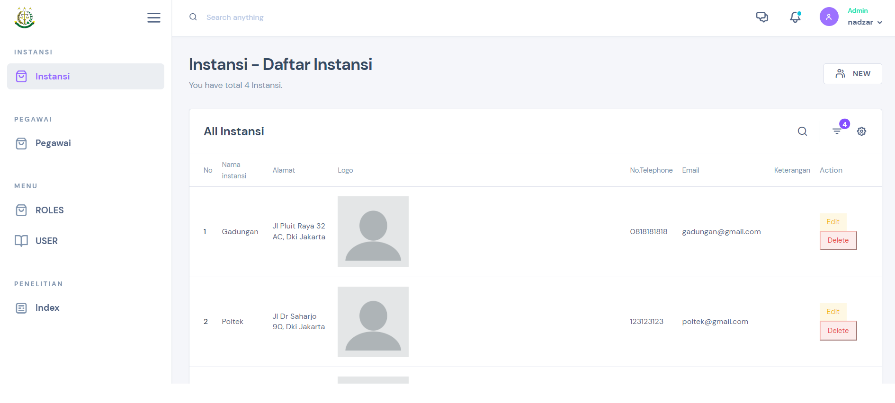

# About the project

The admin dashboard for the Prosecutor's Office, is a web-based interface designed to provide an overview of the office's operations and performance metrics. The dashboard is typically used by the senior management team of Kejaksaan to monitor and manage the office's activities, including the progress of cases, staff performance, financial data, and other critical information.

## Build with :

- Laravel
- Boostrap

# Screenshots of the project

